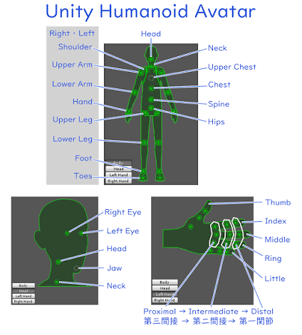
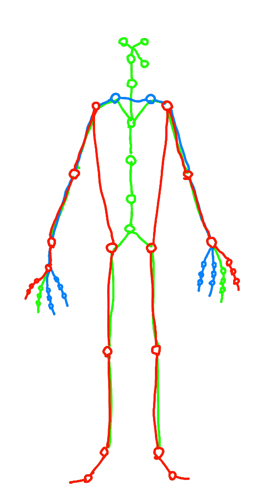
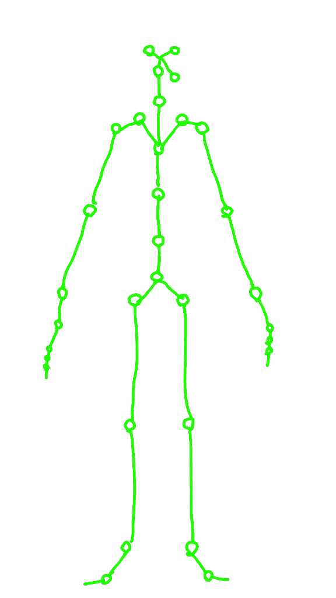
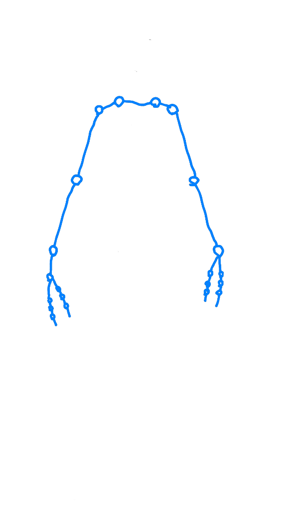
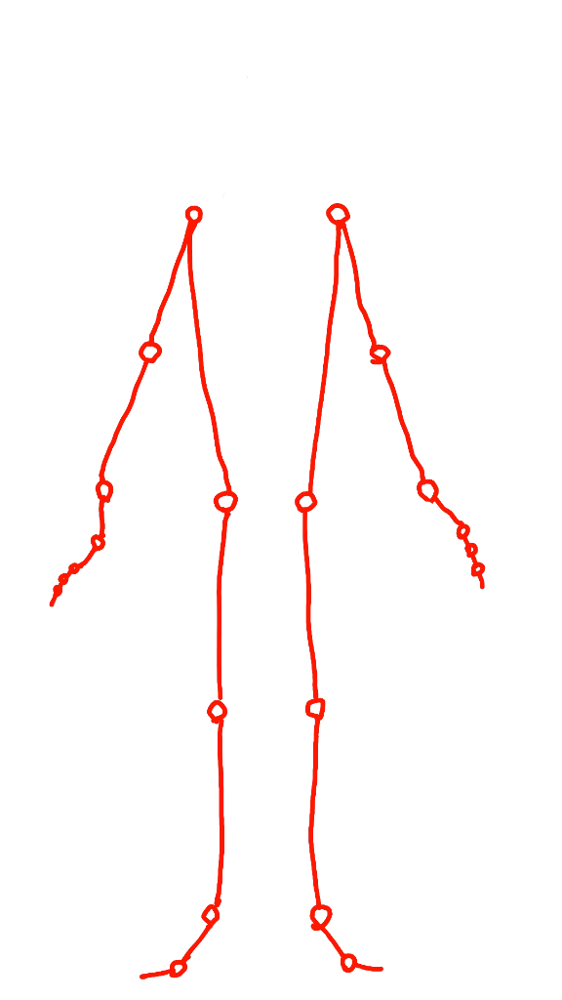

# Implementation Plan - VRM-Based Bone Layout & 3-Chain Functional Decomposition (VRM準拠ボーン配列改変と三機能連鎖分離)

## 1. 概要と背景

ユーザー様よりご提示いただいた **VRM（Unity Humanoid Avatar）標準ノード** および **3系統の機能連鎖図** に準拠し、ボーン配列を再構築します。

従来の SMPL 44ノード（手部なし）から、**VRM 互換の汎用ボーン構造（合計49機能ノード）** へとマッピングを改変し、以下の 3 つの機能連鎖を完全に分離して独立解析を行えるようにします：

1. **中指・全身軸系（Central Axial Chain / 緑）**: 顔3ノード ＋ 体幹・下肢 ＋ 両腕〜中指3関節
2. **橈側・腕系（Radial Arm Chain / 青）**: 鎖骨・両腕 ＋ 親指3関節 ＋ 人差し指3関節
3. **尺側・接地系（Ulnar Grounding Chain / 赤）**: 薬指＋小指（統合）3関節 ＋ 両腕 ＋ 側腹部〜下肢〜足先

---

## 2. VRM 準拠ボーンノード構成表（合計 49 機能ノード）

````carousel

<!-- slide -->

<!-- slide -->

<!-- slide -->

<!-- slide -->

````

### ① 体・四肢（必須＋オプション）：22本
- **体幹・脊柱軸 (6本)**:
  - `Hips` (骨盤 / 身体ルート)
  - `Spine` (脊椎下部)
  - `Chest` (胸部)
  - `UpperChest` (胸部上部 / 鎖骨根)
  - `Neck` (首)
  - `Head` (頭部)
- **上肢腕（左右各4本 ＝ 8本)**:
  - `LeftShoulder`, `RightShoulder` (鎖骨〜肩)
  - `LeftUpperArm`, `RightUpperArm` (上腕)
  - `LeftLowerArm`, `RightLowerArm` (前腕)
  - `LeftHand`, `RightHand` (手首)
- **下肢脚（左右各4本 ＝ 8本)**:
  - `LeftUpperLeg`, `RightUpperLeg` (大腿 / 股関節)
  - `LeftLowerLeg`, `RightLowerLeg` (下腿 / 膝)
  - `LeftFoot`, `RightFoot` (足首 / 踵)
  - `LeftToes`, `RightToes` (足先 / 爪先)

### ② 顔（目・顎）：3本
- `LeftEye` (左目)
- `RightEye` (右目)
- `Jaw` (顎)
  - ※ すべて `Head` ノードの子ノードとして接続。

### ③ 指（左右5本×3関節 ＝ 30本中 24本）
「薬指＋小指（統合）」により、左右それぞれ **4本の指ライン × 3関節（Proximal, Intermediate, Distal）＝ 12関節/手**、**両手合計 24関節** に再編します：
- **親指 (Thumb) [左右各3関節 ＝ 6本]**: `Proximal` (MCP), `Intermediate` (IP), `Distal` (Tip)
- **人差し指 (Index) [左右各3関節 ＝ 6本]**: `Proximal` (MCP), `Intermediate` (PIP), `Distal` (DIP)
- **中指 (Middle) [左右各3関節 ＝ 6本]**: `Proximal` (MCP), `Intermediate` (PIP), `Distal` (DIP)
- **統合尺側指 (Ulnar: Ring + Little) [左右各3関節 ＝ 6本]**:
  $$\text{Joint}_{\text{ulnar\_proximal}} = \frac{\text{Ring}_{\text{MCP}} + \text{Little}_{\text{MCP}}}{2}$$
  $$\text{Joint}_{\text{ulnar\_intermediate}} = \frac{\text{Ring}_{\text{PIP}} + \text{Little}_{\text{PIP}}}{2}$$
  $$\text{Joint}_{\text{ulnar\_distal}} = \frac{\text{Ring}_{\text{DIP}} + \text{Little}_{\text{DIP}}}{2}$$

---

## 3. 3つの機能連鎖（Kinetic Chains）のノード構成とエッジ定義

### 1. 【中指・全身軸系 (`CentralAxialChain` / 緑)】
- **含まれるノード (31ノード)**:
  - 顔3: `LeftEye`, `RightEye`, `Jaw`
  - 体幹6: `Head`, `Neck`, `UpperChest`, `Chest`, `Spine`, `Hips`
  - 下肢8: 左右の `UpperLeg`, `LowerLeg`, `Foot`, `Toes`
  - 上肢腕8: 左右の `Shoulder`, `UpperArm`, `LowerArm`, `Hand`
  - 手先6: 左右の `MiddleProximal`, `MiddleIntermediate`, `MiddleDistal`
- **エッジトポロジー**:
  - `Head` $\to$ `LeftEye`, `RightEye`, `Jaw`
  - `Head` $\to$ `Neck` $\to$ `UpperChest` $\to$ `Chest` $\to$ `Spine` $\to$ `Hips`
  - `Hips` $\to$ `LeftUpperLeg` $\to$ `LeftLowerLeg` $\to$ `LeftFoot` $\to$ `LeftToes` (右も同様)
  - `UpperChest` $\to$ `LeftShoulder` $\to$ `LeftUpperArm` $\to$ `LeftLowerArm` $\to$ `LeftHand` $\to$ `LeftMiddleProximal` $\to$ `LeftMiddleIntermediate` $\to$ `LeftMiddleDistal` (右も同様)
- **解析指標**:
  - 体幹垂直アラインメント、視線・頭部方向、骨盤重心エネルギー $E_{k,\text{core}}$、中指による正中面アラインメント。

### 2. 【橈側・腕系 (`RadialArmChain` / 青)】
- **含まれるノード (20ノード)**:
  - 肩・上肢8: 左右の `Shoulder`, `UpperArm`, `LowerArm`, `Hand`
  - 手先12: 左右の `Thumb` (3関節) ＋ `Index` (3関節)
- **エッジトポロジー**:
  - `LeftShoulder` $\longleftrightarrow$ `RightShoulder` (胸郭鎖骨バー)
  - `Shoulder` $\to$ `UpperArm` $\to$ `LowerArm` $\to$ `Hand`
  - `Hand` $\to$ `ThumbProximal` $\to$ `ThumbIntermediate` $\to$ `ThumbDistal`
  - `Hand` $\to$ `IndexProximal` $\to$ `IndexIntermediate` $\to$ `IndexDistal`
  - ※ 脊柱・骨盤・下肢・頭部は完全除外。
- **解析指標**:
  - 空間直線度（Directness）、リーチ速度、人差し指-親指開き角、上肢固有Jerk。

### 3. 【尺側・接地系 (`UlnarGroundingChain` / 赤)】
- **含まれるノード (22ノード / 左右各11ノードの2本の大黒柱)**:
  - 上肢腕（左右各4）: `Shoulder`, `UpperArm`, `LowerArm`, `Hand`
  - 統合尺側指（左右各3）: `UlnarProximal`, `UlnarIntermediate`, `UlnarDistal`
  - 側腹部〜下肢（左右各4）: `UpperLeg` (側腹部連動), `LowerLeg`, `Foot`, `Toes`
- **エッジトポロジー (左右完全に独立した2系統)**:
  - 左: `LeftUlnarDistal` $\to$ `Intermediate` $\to$ `Proximal` $\to$ `LeftHand` $\to$ `LeftLowerArm` $\to$ `LeftUpperArm` $\to$ `LeftShoulder` $\to$ (側腹部) $\to$ `LeftUpperLeg` $\to$ `LeftLowerLeg` $\to$ `LeftFoot` $\to$ `LeftToes`
  - 右: 同様
  - ※ 左右を繋ぐ水平バー（Hips/Spine/UpperChest）は存在せず、**左右の接地柱**として機能。
- **解析指標**:
  - 床反力（GRF）伝達率、ステップ接地安定度、踏み込みHeaviness、見かけの剛性 $K_{\text{ulnar}}$。

---

## 4. 実装変更点 (Proposed Code Changes)

```
src/
├── core/
│   ├── vrm_bones.py            # [NEW] VRM 49ノード定義・名前・インデックス定数・マッピング
│   ├── chain_decomposer.py     # [NEW] SMPL+MediaPipeからVRM 49ノードへの変換 & 3チェーン分離
│   ├── chain_analyzers.py      # [NEW] 3チェーン独立解析（Central, Radial, Ulnar）
│   ├── types.py                # [MODIFY] VRMSkeletonData, ChainProfiles を型定義に追加
│   └── pipeline.py             # [MODIFY] 49ノードVRMボーン生成 & 3チェーン解析の呼び出し
├── storage/
│   └── adu_exporter.py         # [MODIFY] VRMボーン座標 & 3チェーン別トポロジーのJSON/HDF5出力
└── examples/
    └── demo_vrm_three_chains.py# [NEW] 実データ（MRka5p5qTxw等）からVRM 49ノード & 3チェーン抽出デモ
```

---

## 5. 検証計画

### 自動テスト (`pytest`)
- `tests/test_vrm_bones.py`:
  - VRM 49ノードの定義整合性（体四肢22、顔3、指24）。
  - 4D-Humans (45関節) および MediaPipe (21ランドマーク×2) から VRM 49ノードへのマッピング精度。
  - 3チェーン（緑・青・赤）のノード抽出数およびエッジ接続トポロジーが図と完全に一致するかの検証。
- `tests/test_chain_analyzers.py`:
  - 各チェーンの独立メトリクス（軸安定度、橈側リーチ度、尺側接地剛性）の計算検証。

### 実データ検証
- `examples/demo_vrm_three_chains.py` を実行し、`D:\motion_capture\output_results\MRka5p5qTxw__4dhumans_tracks.pkl` および動画から VRM 49ノードボーン配列および 3 チェーンを抽出し、JSON/HDF5 として出力。
